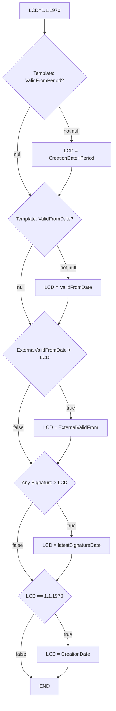

## Legal-Consent-Datum
Das Legal-Consent-Datum sagt aus, ab wann ein IC als gültig betrachtet wird und damit in die Abfragelogik einbezogen wird. Das Datum berechnet sich aus vielen verschiedenen Enflussfaktoren. Wie genau wird im Folgenden beschrieben.

### Einflussfaktoren
- **Anlegedatum:** das Datum an dem ein IC angelegt/erstellt wurde
- **Unterschriften-Datums** alle Datumsangaben von Unterschriften
- **externes Gültigkeitsdatum (ValidFrom)** ein von extern vorgegebenes Gültigkeitsdatum
- **Gültigkeitsdatum (aus Template)** das feste Gültigkeitsdatum aus den ValidFromProperties des Templates
- **Gültigkeitsfrist (aus Template)** Angabe einer Zeitspanne, ab Anlegen eines ICs, wie Lange ein IC noch nicht gültig sein soll. Kommt aus den ValidFromProperties des Templates

## Ablaufdiagramm
LCD = LegalConsentDate
